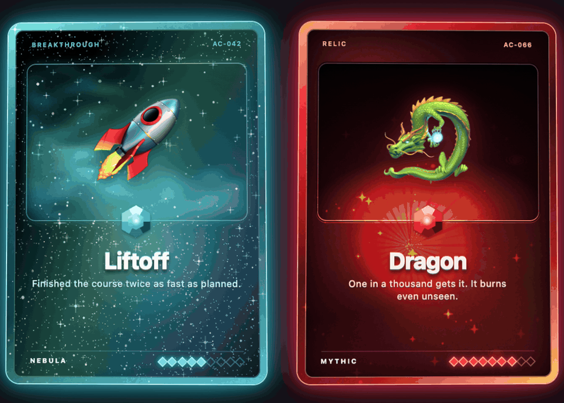
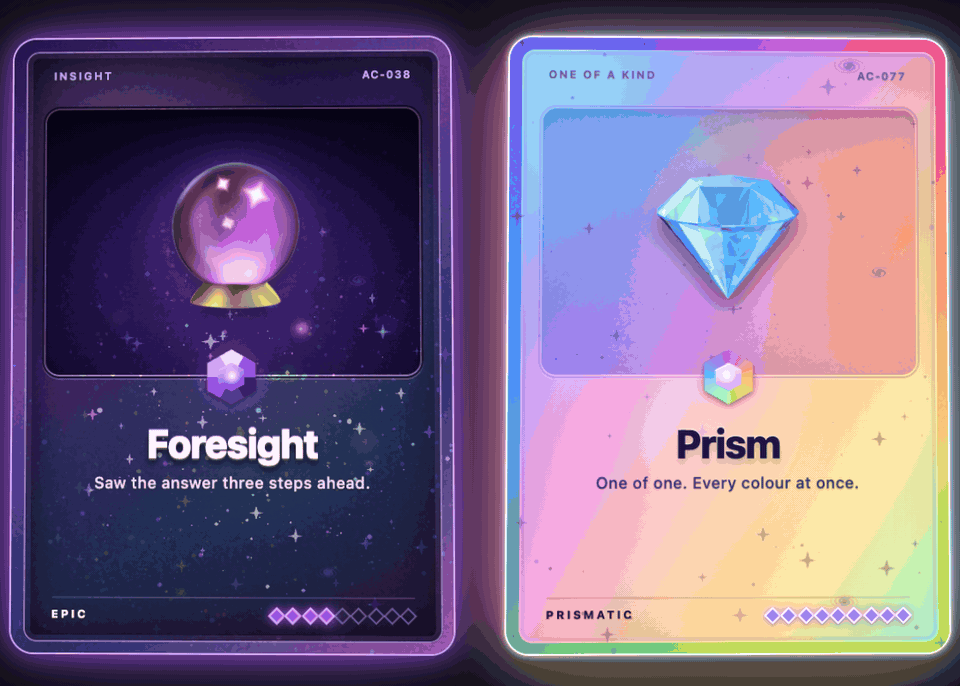
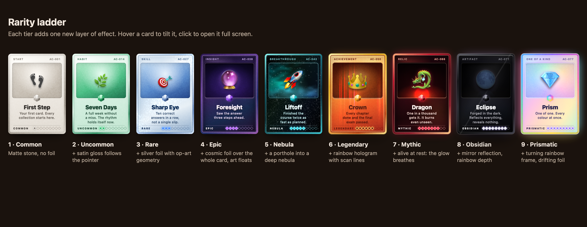

# holo-cards

Holographic collectible cards for the web. Hold the pointer over a card and it tilts towards you, the foil lights up where you look and the art floats above the surface. Click it and it flies out to the centre of the screen.

  

  

## What it feels like

- **Alive under the hand.** The card follows the pointer, a finger or the tilt of a phone, and settles back softly when you let go.
- **Light that responds.** Foil, reflections and sparkles move with the viewing angle, as they do on a real holographic card.
- **Depth.** Art hovers in front of the card; on the rarer cards the surface itself has layers that shift against each other.
- **A moment of reveal.** A clicked card flies out of the grid, turns once and opens large in the middle of the screen, then returns to its place.
- **Calm for those who need it.** With reduced motion switched on in the system, the cards stay still; everything works from the keyboard.

## Rarity you can read at a glance

  

Each rank adds one visible layer on top of the previous one, so the order reads without labels.

| # | Rank      | Material      | Adds                                                        |
|---|-----------|---------------|-------------------------------------------------------------|
| 1 | Common    | matte stone   | grain and a soft shadow, no foil                            |
| 2 | Uncommon  | jade satin    | a gloss band that follows the pointer                       |
| 3 | Rare      | silver foil   | a metallic glint on the frame, op-art geometry beneath it   |
| 4 | Epic      | cosmic foil   | foil over the whole card, stars open up around the pointer  |
| 5 | Nebula    | deep space    | a porthole into a bright nebula, stars drifting in parallax |
| 6 | Legendary | rainbow gold  | a rainbow hologram over scan lines, crossing bars of light  |
| 7 | Mythic    | crimson ember | alive at rest: the glow breathes, rays and embers           |
| 8 | Obsidian  | black glass   | depth by parallax, a mirror reflection                      |
| 9 | Prismatic | pearl         | a rainbow frame that turns on its own, drifting foil        |

## Made to drop in

No dependencies and no framework required: a card is plain markup and a stylesheet. Colours, fonts and textures are open to restyling, and every rank lives in its own file, so a new one is a copy away. All textures are generated in the repository, with no third-party images.

## Learn more

- [Usage](docs/usage.md) — putting a card on a page, the API, theming, development.
- [Architecture](docs/architecture.md) — how the layers and the tilt are built.

## License

[MIT](LICENSE). The textures are generated by `scripts/gen-textures.py` and ship under the same licence.
